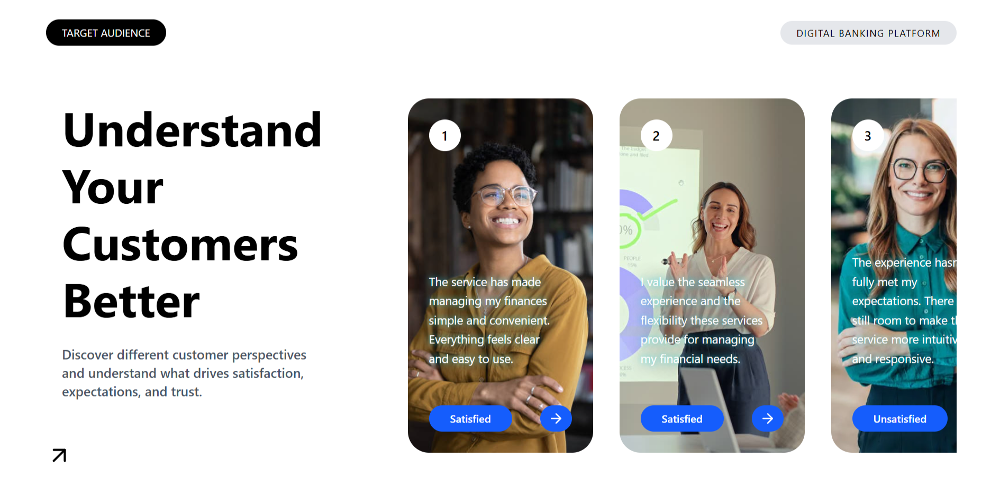

# Modern UI — Customer Segmentation

A modern React UI concept for a digital banking platform, focused on presenting prospective customer segments and their perspectives through a clean, card-based interface.

> **UI-only project:** This project is focused on frontend design and user experience. Buttons, navigation elements, and customer states are visual UI elements only and are not connected to real functionality, data, or backend services.

## ✨ Preview

The interface explores how a digital banking platform could present different customer perspectives and satisfaction segments.

The design includes:

* Customer profile cards with imagery
* Satisfied and unsatisfied customer segments
* Customer-focused messaging
* Visual CTA and navigation elements
* Large typography and clear visual hierarchy
* Clean, modern fintech-inspired layout




## 🎯 Concept

The interface is built around the idea of understanding customers better and presenting different customer perspectives in a simple visual format.

The main message of the UI is:

> **Know Your Customers. Build Better Experiences.**

The customer segments are represented through different perspectives, such as satisfied and unsatisfied experiences, to create a more engaging presentation of the concept.

## 🛠️ Tech Stack

* **React**
* **Vite**
* **JavaScript / JSX**
* **CSS**
* **ESLint**
* **npm**

## 📁 Project Structure

```text
modern-ui/
├── public/
│   └── icon.png
│
├── src/
│   ├── components/
│   │   └── Section1/
│   │       ├── Arrow.jsx
│   │       ├── HeroText.jsx
│   │       ├── LeftContent.jsx
│   │       ├── Navbar.jsx
│   │       ├── Page1Content.jsx
│   │       ├── RightCard.jsx
│   │       ├── RightCardContent.jsx
│   │       ├── RightContent.jsx
│   │       └── Section1.jsx
│   │
│   ├── App.jsx
│   ├── index.css
│   └── main.jsx
│
├── .gitignore
├── eslint.config.js
├── index.html
├── package.json
├── package-lock.json
├── README.md
└── vite.config.js
```

## 🚀 Getting Started

### 1. Clone the repository

```bash
git clone https://github.com/MohdZaid001/modern-ui.git
```

### 2. Navigate to the project

```bash
cd modern-ui
```

### 3. Install dependencies

```bash
npm install
```

### 4. Start the development server

```bash
npm run dev
```

Open the local development URL shown in your terminal.

Usually:

```text
http://localhost:5173
```

## 🎨 Design

The UI follows a modern fintech-inspired visual direction with an emphasis on simplicity, typography, spacing, and visual hierarchy.


## 👨‍💻 Author

**Mohd Zaid**

A React UI project created to practice modern frontend development, component architecture, CSS styling, and interface design.

## 📄 License

This project is intended for learning and portfolio purposes.
